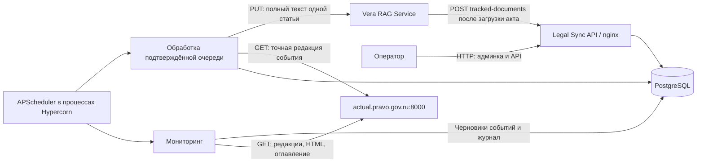

# Legal Sync Service

Сервис мониторинга изменений нормативных актов и подготовки обновлений для
`vera_rag_service`. Он хранит реестр документов, находит изменённые статьи в
банке консолидированных редакций, создаёт события для проверки оператором и
после подтверждения передаёт текст статьи в RAG в нужный срок.

Документ описывает реализацию на **16.09.2026**, включая конфигурацию в админке
и журнал мониторинга. Примеры дат, ID и текстов ниже иллюстрируют контракт;
при работе используйте реквизиты своего документа и ID из ответов API.

Содержание:

- [Архитектура и направления запросов](#architecture)
- [Идентификаторы и даты](#identifiers)
- [Как проходит мониторинг](#monitoring)
- [Как определяются границы и извлекается статья](#extraction)
- [События, подтверждение и отправка](#lifecycle)
- [Контракт входящего API Legal Sync](#api-contract)
- [Контракт обновления статьи в RAG](#rag-contract)
- [Контракт обращений к порталу](#portal-contract)
- [Быстрый старт](#быстрый-старт) и [Docker Compose](#развёртывание-через-docker-compose)
- [Админка, конфигурация и журнал](#administration)
- [Диагностика и ограничения](#diagnostics)
- [Устройство кода и проверки](#development)

<a id="architecture"></a>

## Архитектура и направления запросов



| Участник | Адрес / интерфейс | Задача |
| --- | --- | --- |
| Legal Sync снаружи | `http://<IP>:8003`, порт задаётся `LEGAL_SYNC_PORT` | API, Swagger и админка через nginx |
| Приложение внутри Compose | `legal_sync_service:8000` | FastAPI, SQLAdmin, фоновые задания |
| База внутри Compose | `db:5432` | Реестр, очередь, конфигурация и история проверок |
| Банк редакций | `http://actual.pravo.gov.ru:8000/api/ebpi` | Списки редакций, консолидированный HTML, оглавление, карточки актов |
| RAG | `RAG_SERVICE_BASE_URL`, сейчас в примере `.env` — `http://91.218.115.104:8002` | Получение актуального текста статьи и переиндексация |

Мониторинг использует банк редакций конкретных документов. Клиент
`publication.pravo.gov.ru` и его настройки остаются в проекте, но текущий
плановый обход его не вызывает. Загрузка PDF, OCR, браузер и LLM в этом
алгоритме Legal Sync не участвуют. Обогащение и эмбеддинги — работа RAG.

Регистрация документа, обнаружение изменений, пробное извлечение и доставка
являются отдельными операциями. Успешное выполнение одной не подтверждает
выполнение остальных. Например, `consolidated_text` может появиться после
пробного извлечения; факт доставки проверяется по `status=sent`, `sent_at`
и `rag_response`.

<a id="identifiers"></a>

## Идентификаторы и даты

| Поле | Значение |
| --- | --- |
| `tracked_documents.id` | Числовой ID записи Legal Sync; используется в URL `/tracked-documents/{document_id}` |
| `tracked_documents.document_id` | Строковый ID документа в RAG; передаётся в URL обновления статьи |
| `ebpi_doc_hash` / `ebpi_doc_id` | Идентификаторы основного акта в банке редакций |
| `legal_changes.id` | ID события; используется в `/legal-changes/{change_id}` |
| `ebpi_redaction_id` | ID конкретной редакции основного акта (`redid` портала) |
| `amending_doc_hash` | Идентификатор акта-поправки; отличается от идентификатора основного акта |
| `section_number` | Номер статьи строкой: `14`, `15.1`, `351.9` |
| `run_id` | ID запуска в журнале мониторинга, не ID события изменения |

| Поле времени | Правило |
| --- | --- |
| `tracked_documents.adoption_date` | Дата подписания основного акта, нужна для поиска |
| `monitor_from` | Нижняя включительная граница дат редакций; без значения берётся `date.today()` в часовом поясе процесса |
| `amending_act_date` | Дата подписания акта-поправки из его карточки |
| `redaction_date` | Значение `reddate` портала; в модели сервиса это дата вступления редакции в силу |
| `effective_date` | Срок изменения; мониторинг ставит дату редакции, оператор может уточнить её при подтверждении |
| `send_at` | `effective_date` в `00:00:00 UTC`; рассчитывается при создании события через сервис и при подтверждении |
| `sent_at` | Время успешной обработки ответа RAG |
| `created_at` / `updated_at` | Создание / изменение записи; `updated_at` документа не означает время последней проверки |

Часовой пояс в «Конфигурации» управляет расписанием. Он не меняет правило
расчёта `send_at` и часовой пояс ОС. Например, при `send_at=2027-03-01T00:00:00Z`
и отправке ежедневно в `04:00 Europe/Moscow` событие попадёт в обработку
в `04:00` Москвы, то есть в `01:00 UTC`. Фактическая доставка происходит при
первом подходящем запуске очереди после срока, а не отдельным таймером события.

<a id="monitoring"></a>

## Как проходит мониторинг

Входы: планировщик или `POST /api/v1/monitoring/run`. Оба вызывают
[`MonitoringService`](app/services/monitoring.py) и используют одну блокировку
PostgreSQL. Обход последовательный, только по документам с `is_active=true`.

1. В БД создаётся запись запуска. Параллельная попытка фиксируется как
   `skipped`, без второго обхода. Повтор той же минуты расписания также
   пропускается, даже если первый процесс уже завершил проверку.
2. Если `ebpi_doc_hash` отсутствует, сервис ищет основной акт по
   `document_number` и словам **`full_title`**. Из результатов выбираются
   совпавшие по `adoption_date`. Нет совпадений — ошибка документа; несколько
   совпадений — предупреждение и выбор первого. Найденные hash и ID сохраняются.
   Это происходит при первой проверке, а не во время регистрации через API.
3. По hash запрашивается полная история редакций (`ttl=3`). Редакции
   упорядочиваются по дате и порядковому номеру в начале подписи. Числовой
   `redid` не используется как показатель новизны.
4. Отбираются редакции с датой `>= monitor_from`, кроме исходной
   (`redinitial=true`) и редакций, по которым уже есть события этого документа.
   Будущие редакции тоже рассматриваются. Флаг `actual` не ограничивает выборку.
5. Если `redcompleted=false` у выбранной или предыдущей редакции,
   обработка этой редакции откладывается. В журнале остаётся предупреждение;
   следующий запуск попробует её снова.
6. Из подписи редакции извлекаются номер и дата акта-поправки, например
   `(№ 246-ФЗ от 26.07.2026)` → `от 26.07.2026 № 246-ФЗ`. Загружаются HTML
   и оглавление редакции. По ссылке с такими реквизитами определяется
   `gohash` акта-поправки. Отсутствие реквизитов или ссылки фиксируется
   предупреждением; события по этой редакции не создаются.
7. Абзацы с `span.cmd`, содержащим нужный `gohash` в `cmdprm`, сопоставляются
   со статьями по оглавлению. Ссылки в преамбуле не считаются изменением статьи.
   Если есть предыдущая редакция, сравниваются полные тексты отмеченных статей
   после нормализации пробелов. Неизменившаяся статья исключается; отсутствующая
   в предыдущей редакции статья считается новой. Предыдущая редакция может
   быть старше `monitor_from` — она всё равно нужна для сравнения.
8. Карточка акта-поправки даёт его вид, номер и дату. Ошибка её загрузки
   оставляет предупреждение, но не отменяет уже определённые изменения статей.
9. На каждую изменившуюся статью создаётся `legal_change` в `draft`.
   `redaction_date` и `effective_date` берутся из даты редакции,
   `change_description` — из её подписи. Все статьи одной редакции записываются
   одной транзакцией. Уникальность: `(tracked_document_id, ebpi_redaction_id,
   section_number)`; конфликт этого ключа пропускается.
10. Сохраняется итог каждого документа и всего запуска. Известная ошибка
    источника, разбора или репозитория одного документа не мешает проверке
    остальных. Неожиданная ошибка завершает запуск с ошибкой и стеком вызовов.

Один акт-поправка может дать несколько событий по разным статьям и разным
датам редакций. Например, пять строк с одним номером закона-поправки — это
пять отдельных статей для проверки, а не пять загрузок одного закона.

Редакция считается уже обработанной **по наличию её событий**, независимо
от их статусов. Если событий не получилось, она будет рассмотрена снова.
Журнал проверок сам по себе не является маркером «редакция обработана».

`publication_block` сохраняется как реквизит регистрации, но текущий обход
редакций его не использует. `delta_text` автоматически не заполняется:
сервис не скачивает текст поправки для последующего применения к статье.

<a id="extraction"></a>

## Как определяются границы и извлекается статья

Общий алгоритм для пробного извлечения и отправки реализован в
[`SectionTextService`](app/services/section_text.py) и
[`RedactionDocument`](app/services/redaction_parser.py).

1. Берётся **`ebpi_redaction_id` события**. В списке редакций основного акта
   проверяются наличие именно этой редакции и готовность её текста.
2. Загружаются `/redtext` и `/getcontent/` с одним и тем же ID редакции.
3. HTML разбирается через BeautifulSoup/lxml. Все `<p>` собираются в порядке
   следования; строится индекс `id абзаца → позиция в документе`.
4. В оглавлении выбираются узлы с `unit="статья"`. `np` указывает первый
   абзац, `npe` — последний. В текст включаются обе границы.
5. Если начало найдено, а `npe` отсутствует в HTML, используется ближайшее
   следующее начало единицы оглавления того же или более высокого уровня
   (`other.lvl <= article.lvl`). Конец статьи — абзац перед этой единицей.
   Она может быть следующей статьёй, главой или разделом.
6. Если надёжной границы нет, статья помечается некорректной; при попытке
   извлечь её возникает ошибка. Обрезание «до первого похожего заголовка»
   и безусловное чтение до конца документа не используются.
7. Из выбранных абзацев берётся текст без HTML, схлопываются пробелы,
   непустые абзацы соединяются переводом строки. Заголовок статьи включён.
   Надстрочный индекс в номере нормализуется: `15¹` → `15.1`.

```text
Оглавление: статья 14 → np=p100, npe=p104
HTML:       p100 ... p101 ... p104 ... p105 (начало следующей статьи)
Результат:  текст p100–p104 включительно; p105 в статью 14 не входит.
```

Числа в `p100` и `p104` не задают диапазон: используются позиции реально
найденных абзацев. Сервис не пересказывает статью и не применяет к ней
текстовые инструкции закона-поправки. Он берёт уже консолидированный текст
нужной редакции. Редакционные примечания внутри выбранных абзацев сохраняются.

Разбор HTML выполняется в пуле потоков, чтобы не блокировать HTTP-приложение.
При отправке несколько статей одной редакции используют общий разобранный
объект в пределах запуска. Между запусками этого кэша нет; успешное preview
тоже не заменяет повторную загрузку при реальной отправке.

<a id="lifecycle"></a>

## События, подтверждение и отправка

| Статус события | Значение / переход |
| --- | --- |
| `draft` | Найдено мониторингом или создано вручную; автоматически не отправляется |
| `scheduled` | Подтверждено через `/approve`; ожидает срока и запуска очереди |
| `processing` | Обработчик загрузил событие и начал извлечение / доставку |
| `sent` | Ответ RAG успешно обработан, сохранены текст, источник, `sent_at` и `rag_response` |
| `failed` | Ошибка обработки, заполнены `last_error` и `retry_count`; возможен повтор |
| `cancelled` | Отменено оператором или отклонено RAG как устаревшая редакция |
| `approved` | Присутствует в enum и форме админки; штатный `/approve` сразу ставит `scheduled`, очередь `approved` не выбирает |

Для отправки должны одновременно выполняться условия:

- В конфигурации включён `rag_delivery_enabled`.
- Статус — `scheduled` или `failed`.
- `send_at` задан и `send_at <= now` в UTC.
- `retry_count < processing_max_retries`.

Очередь сортируется по `send_at`, затем по ID. Снятие документа с контроля
(`is_active=false`) прекращает поиск новых изменений, но **не блокирует
доставку уже подготовленных событий**. Общий выключатель доставки находится
в «Конфигурации».

После захвата отдельной блокировки обработки оставшиеся от оборванного
процесса `processing` возвращаются в `scheduled`. Далее событие переводится
в `processing`, извлекается статья, ещё раз проверяется выключатель доставки
и выполняется PUT в RAG. Неготовая редакция возвращает событие в `scheduled`
без увеличения счётчика ошибок. Отключение доставки во время извлечения
возвращает прежний статус; уже начатый HTTP-запрос может завершиться.

Сетевая ошибка, ошибка разбора или отклонение RAG увеличивают `retry_count`
и переводят событие в `failed`. В текущей реализации обычные `4xx`, включая
`422` и `429`, тоже проходят через этот механизм. Повтор выполняется при
следующем запуске очереди до лимита, без отдельного таймера backoff.
`retry_count` считает неудачные обработки, а не все успешные HTTP-вызовы.
Причина в `last_error` ограничена 2 000 символами; полный стек — в логах.

Специальный ответ `409` с `detail.code="stale_revision"` переводит событие
в `cancelled`: в RAG уже находится более поздняя редакция. Это учитывается
в `changes_superseded`, повтор не нужен. Обычный `409` другого формата
обрабатывается как ошибка.

Доставка допускает повтор после потери ответа: если RAG принял статью, а
Legal Sync не успел сохранить `sent`, следующая обработка повторит ту же
редакцию. RAG должен разрешать равную дату и отклонять более старую.
Между двумя сервисами нет общей транзакции и гарантии единственного HTTP-запроса.

<a id="api-contract"></a>

## Контракт входящего API Legal Sync

Префикс по умолчанию — `/api/v1` (`API_V1_PREFIX`). JSON-схемы доступны на
`/docs` и `/openapi.json`. Все методы таблицы, кроме `/health`, требуют
заголовок `X-API-Key` со значением `API_KEY` сервиса Legal Sync.
Отсутствующий или неверный ключ даёт `401`.

| Метод и путь после префикса | Вход | Результат |
| --- | --- | --- |
| `GET /health` | Без ключа | `200 {"status":"ok","database":"ok"}` после `SELECT 1` |
| `POST /tracked-documents` | Реквизиты документа, пример ниже | `201`, запись реестра; повтор `document_id` — `409` |
| `GET /tracked-documents` | `page=1`, `page_size=20` (1–100), необязательный `is_active` | `200`, `total`, `page`, `page_size`, `items` |
| `GET /tracked-documents/{document_id}` | **Внутренний числовой ID** | `200`, запись; `404`, если нет |
| `PATCH /tracked-documents/{document_id}` | Изменяемые поля реестра, например `{"is_active":false}` | `200`, обновлённая запись |
| `POST /monitoring/run` | Без тела | `200`, сводка мониторинга и `run_id` |
| `POST /legal-changes` | `tracked_document_id`, `section_number`, `amending_law_ref`; остальные поля по схеме | `201`, событие в `draft` |
| `GET /legal-changes` | `page`, `page_size`, необязательный `status` | `200`, пагинированный список |
| `GET /legal-changes/{change_id}` | ID события | `200`, полная карточка события |
| `POST /legal-changes/{change_id}/approve` | `reviewed_by`, необязательные `review_notes`, `effective_date` | `200`, `draft` → `scheduled`; другой статус — `409` |
| `POST /legal-changes/{change_id}/cancel` | Необязательный **query** `review_notes` | `200`, событие в `cancelled` |
| `POST /legal-changes/{change_id}/preview` | `as_of` с часовым поясом | `200`, результат пробного извлечения |
| `POST /monitoring/process` | Без тела | `200`, сводка обработки очереди |

Ошибки валидации запроса — `422`. Доменные HTTP-ошибки возвращаются в
`{"detail": ...}`; ошибки FastAPI-валидации содержат список в `detail`.
Необработанный внутренний сбой может дать `500`, в том числе недоступность
БД на `/health`. Health проверяет приложение и PostgreSQL, но не портал,
RAG, наличие заданий или свежесть последней проверки.

Ниже команды для **Bash**. Переменная с ключом должна быть задана в оболочке;
наличие `.env` само по себе её не экспортирует.

```bash
export LEGAL_SYNC_URL='http://91.218.115.104:8003'
export LEGAL_SYNC_API_KEY='<значение API_KEY из .env Legal Sync>'
```

### Постановка документа на контроль

```bash
curl --fail-with-body -X POST "$LEGAL_SYNC_URL/api/v1/tracked-documents" \
  -H "X-API-Key: $LEGAL_SYNC_API_KEY" \
  -H 'Content-Type: application/json' \
  --data '{
    "document_id": "fz-181-1995",
    "short_name": "181-ФЗ — социальная защита инвалидов",
    "full_title": "О социальной защите инвалидов в Российской Федерации",
    "category": "federal_law",
    "audience": "both",
    "topics": [],
    "source_title": "Федеральный закон от 24.11.1995 № 181-ФЗ «О социальной защите инвалидов в Российской Федерации»",
    "publication_block": "president",
    "document_number": "181-ФЗ",
    "adoption_date": "1995-11-24",
    "is_active": true
  }'
```

`document_id` должен совпадать с фактическим ID акта в RAG. Legal Sync не
проверяет существование этого ID в RAG при регистрации.
Обязательны `document_id`, `short_name`, `full_title`, `category`, `audience`,
`source_title`, `publication_block`, `document_number`, `adoption_date`.
Необязательны `topics=[]`, `is_active=true`, `monitor_from`.

`201` возвращает эти поля и `id`, рассчитанный `monitor_from`,
`ebpi_doc_hash`, `ebpi_doc_id`, `created_at`, `updated_at`. До первой успешной
проверки идентификаторы портала обычно равны `null`. Повторная регистрация
не обновляет реквизиты: используйте PATCH по внутреннему ID. Строковый ID
RAG через PATCH не меняется. Для обязательных полей PATCH передавайте
новое значение или пропускайте поле; `null` не является командой очистки.

Штатный клиент RAG вызывает этот контракт после успешной полной загрузки
при `LEGAL_SYNC_ENABLED=true` для отслеживаемой категории. Он передаёт
`act_title → full_title`, `act_number → document_number`,
`act_date → adoption_date`, а в `short_name` — `act_type` либо `act_title`.
Поэтому искать основной акт по `short_name` нельзя.
RAG трактует `409` как «уже на контроле»; сбой регистрации логируется в RAG
и не откатывает уже выполненную индексацию. Наличие документа в RAG само
по себе не подтверждает наличие записи Legal Sync.

### Ручная проверка и ответ мониторинга

```bash
curl --fail-with-body -X POST "$LEGAL_SYNC_URL/api/v1/monitoring/run" \
  -H "X-API-Key: $LEGAL_SYNC_API_KEY"
```

Запрос синхронный: ответ приходит после обхода. Пример ответа:

```json
{
  "run_id": 42,
  "already_running": false,
  "documents_checked": 1,
  "changes_created": 1,
  "documents_failed": 0,
  "items": [{
    "document_id": "fz-181-1995",
    "redactions_total": 20,
    "redactions_pending": 1,
    "redactions_skipped_incomplete": 0,
    "changes_created": 1,
    "error": null
  }]
}
```

`documents_checked` включает документы с ошибкой; проверяйте также
`documents_failed` и `items[].error`. Ошибка отдельного документа может
присутствовать в успешном HTTP `200`. `redactions_pending` — число отобранных
редакций, а не число созданных событий. Параллельная попытка возвращает
`already_running=true`, свой `run_id`, нулевые счётчики и пустой `items`.
Если журнал не удаётся сохранить, возвращается `503` без обхода документов.
Карточка запуска: `/admin/monitoring-log/42`, с авторизацией админки.

### Подтверждение и отмена события

Для подтверждения черновика:

```bash
curl --fail-with-body -X POST "$LEGAL_SYNC_URL/api/v1/legal-changes/10/approve" \
  -H "X-API-Key: $LEGAL_SYNC_API_KEY" -H 'Content-Type: application/json' \
  --data '{"reviewed_by":"operator","review_notes":"Проверены редакция и статья","effective_date":"2027-09-01"}'
```

Ответ — полная карточка события. Будут заполнены `reviewed_by`, `reviewed_at`,
`review_notes`, установлены `status=scheduled` и
`send_at=2027-09-01T00:00:00Z`. Если `effective_date` не передана,
используется дата события. Если даты нет в обоих местах, `send_at` останется
пустым и событие не попадёт в очередь.

Отмена: `POST /api/v1/legal-changes/10/cancel?review_notes=...` без JSON-тела.
Отмена не откатывает уже доставленный текст и не останавливает обработку,
которую воркер уже начал. Обычное редактирование статуса в форме SQLAdmin
записывает поля напрямую; оно не заменяет расчёт дат и автора через `/approve`.

### Пробное извлечение на условную дату

```bash
curl --fail-with-body -X POST "$LEGAL_SYNC_URL/api/v1/legal-changes/10/preview" \
  -H "X-API-Key: $LEGAL_SYNC_API_KEY" -H 'Content-Type: application/json' \
  --data '{"as_of":"2027-09-01T00:00:00Z"}'
```

Нужен `as_of` с `Z` или UTC-смещением. Проверяется `as_of >= send_at`;
реальные часы и даты события не меняются. Исходы:

| `outcome` | Поведение |
| --- | --- |
| `not_due` | Срок не наступил; портал не вызывается |
| `redaction_not_ready` | Срок наступил, но портал ещё готовит редакцию; сохранённый текст не меняется |
| `extracted` | Статья извлечена; обновлены текст, источник и `updated_at` события |

Пример ответа с **условным текстом**, показывающий все поля результата:

```json
{
  "change_id": 10,
  "as_of": "2027-09-01T00:00:00Z",
  "send_at": "2027-09-01T00:00:00Z",
  "event_status": "draft",
  "section_number": "14",
  "redaction_id": 444605,
  "redaction_date": "2027-09-01",
  "outcome": "extracted",
  "message": "Статья извлечена и сохранена в карточке события. Отправка не выполнялась.",
  "consolidated_text": "Статья 14. Тестовый текст.",
  "consolidated_text_source": "actual.pravo.gov.ru: редакция 444605 от 2027-09-01",
  "text_length": 26,
  "rag_sent": false
}
```

Preview доступен для `draft`, `approved`, `scheduled`, `failed`, в том числе
у снятого с контроля документа. Необходим заполненный `send_at`.
Общая с отправкой блокировка, недопустимый статус или изменение события
во время загрузки дают `409`; отсутствующее событие / статья — `404`;
ошибка получения или разбора — обычно `502`. Поля статуса, отправки и попыток
не меняются. Клиент RAG не вызывается при любом положении выключателя доставки.

### Запуск очереди отправки

`POST /api/v1/monitoring/process` с API-ключом и без тела возвращает:

```json
{
  "delivery_disabled": true,
  "already_running": false,
  "changes_recovered": 0,
  "changes_superseded": 0,
  "changes_selected": 0,
  "changes_sent": 0,
  "changes_failed": 0,
  "changes_postponed": 0
}
```

При выключенной доставке очередь не меняется. При включённой — применяется
алгоритм [обработки событий](#lifecycle). `changes_recovered` — возвращённые
из оборванного `processing`; `changes_postponed` — неготовые редакции;
`changes_superseded` — отклонённые устаревшие изменения.
Если конфигурация недоступна, возвращается `503`.
Как и у мониторинга, HTTP `200` сам по себе не означает отсутствие ошибок:
нужно читать счётчики и карточки событий.

<a id="rag-contract"></a>

## Контракт обновления статьи в RAG

Исходящий запрос выполняет [`RagClient`](app/clients/rag.py):

```text
PUT {RAG_SERVICE_BASE_URL}/api/v1/document/{document_id}/sections/{section_number}
X-API-Key: значение RAG_SERVICE_API_KEY
Content-Type: application/json
```

Здесь `document_id` — строковый ID документа **из RAG**, не ID строки реестра.
Номер статьи передаётся строкой, включая номера вроде `15.1`.
`RAG_SERVICE_API_KEY` должен совпадать с `API_KEY` принимающего сервиса RAG.
Обратная регистрация использует другой ключ — `API_KEY` Legal Sync.

Пример тела с условным текстом статьи:

```json
{
  "category": "federal_law",
  "raw_text": "Статья 14. Тестовый текст.",
  "section_title": "Статья 14. Условный заголовок",
  "revision_date": "2027-09-01",
  "audience": "both",
  "source_title": "Федеральный закон от 24.11.1995 № 181-ФЗ «О социальной защите инвалидов в Российской Федерации»",
  "topics": [],
  "amending_act_type": null,
  "amending_act_number": null,
  "amending_act_date": null
}
```

| Поле запроса | Откуда берётся |
| --- | --- |
| `category` | Категория документа; RAG поддерживает обновление `labor_code`, `federal_law`, `other_npa` |
| `raw_text` | Полный извлечённый текст одной статьи, включая заголовок; не `delta_text` и не текст закона-поправки |
| `section_title` | Заголовок события; если отсутствует — `short_name` документа |
| `revision_date` | `redaction_date`, при её отсутствии — `effective_date`; без обеих дат отправка невозможна |
| `audience` | Непустой `audience_override` события либо значение документа; контракт RAG: `seeker`, `employer`, `both` |
| `source_title` | Непустой `source_title_override` события либо полное наименование источника из документа |
| `topics` | `topics_override`, если не `null`, иначе темы документа; пустой список переопределения очищает темы |
| `amending_act_type`, `amending_act_number`, `amending_act_date` | Реквизиты поправки из события; неизвестные значения передаются как `null`, дата — `YYYY-MM-DD` |

Для `labor_code` и `federal_law` темы должны быть пустыми; непустые темы
допускаются у `other_npa`. API регистрации Legal Sync хранит `category` и
`audience` как строки и не проверяет их по enum RAG: ошибку метаданных нужно
исправлять в реестре до отправки. Поле `version` не отправляется — RAG
вычисляет его из `revision_date`.

Ожидаемый ответ `200`:

```json
{
  "document_id": "fz-181-1995",
  "section_number": "14",
  "parent_id": "fz-181-1995:14",
  "version": "2027-09-01",
  "chunks_count": 4,
  "superseded_chunks": 3
}
```

RAG разбивает статью на чанки, обогащает и индексирует новую редакцию,
проверяет результат и помечает предыдущие чанки неактуальными с
`effective_until`; история редакций сохраняется. Legal Sync сохраняет JSON
ответа в `rag_response`. Сейчас клиент проверяет возможность разобрать JSON,
но не валидирует успешный ответ отдельной типизированной схемой.

Особый ответ для устаревшей редакции:

```json
{
  "detail": {
    "code": "stale_revision",
    "message": "Документ fz-181-1995: редакция 2027-09-01 устарела; уже загружена редакция 2028-01-01.",
    "document_id": "fz-181-1995",
    "revision_date": "2027-09-01",
    "current_revision_date": "2028-01-01"
  }
}
```

HTTP `409` с этим кодом и строковым `message` означает отмену события без
повтора. Равная дата допускается для восстановления после потери ответа.
Пустой после обработки текст RAG отклоняет, сохраняя действующие чанки.

Таймаут одного вызова задаёт `RAG_SERVICE_TIMEOUT_SECONDS` (по умолчанию 60).
Немедленных HTTP-повторов у клиента RAG нет: ошибку повторяет очередь по
[правилам событий](#lifecycle). В текущем коде RAG для этого маршрута установлен
лимит `10/minute`; отдельного ограничения скорости отправки в Legal Sync нет.
Ответ `429` учитывается как неудачная попытка, что важно при большой очереди.
Контракт принимающей стороны сверён с соседним проектом `vera_rag_service`;
это описание кода, а не проверка доступности его продакшен-инстанса.

<a id="portal-contract"></a>

## Контракт обращений к порталу

Все запросы — `GET` к `PRAVO_EBPI_BASE_URL`, по умолчанию
`http://actual.pravo.gov.ru:8000/api/ebpi`. Во всех передаётся query-параметр
`bpa=ebpi` (`PRAVO_EBPI_BANK`), авторизация не требуется. Параметры `q` и `t`
там, где указано, содержат **JSON-строку с URL-кодированием**.
Контракт восстановлен по интерфейсу портала; официальной гарантии
неизменности схемы у клиента нет.

| Путь | Query помимо `bpa` | Используемый результат |
| --- | --- | --- |
| `/attrsearch/` | `q=<JSON условий поиска>` | `docs[]`: `docid`, `dochash`, `docpass0number`, `docpass0date` |
| `/redactions/` | `t={"hash":"<hash основного акта>","ttl":3}` | `redactions[]`: `redid`, `reddate`, `redcaption`, `redinitial`, `redcompleted`, `actual` |
| `/redtext` | `t=<redid>`, `ttl=0` | `redtext`: HTML всей конкретной редакции |
| `/getcontent/` | `rdk=<тот же redid>` | `data[]`: узлы оглавления `id`, `caption`, `unit`, `lvl`, `np`, `npe` |
| `/card/` | `t={"hash":"<hash акта-поправки>"}` | `adoptions[0]`: `type`, `onumber`, `odate` для реквизитов поправки |

Условия `q` для поиска по номеру и словам названия:

```json
[
  {"AttrId": 6, "AttrMode": 0, "Words": ["181-ФЗ"]},
  {"AttrId": 7, "AttrMode": 9, "Words": ["+о", "+социальной", "+защите", "+инвалидов", "+в", "+российской", "+федерации"]},
  {"AttrId": 999, "AttrMode": 1, "Words": [20, "date", "20220701", 0, 1]}
]
```

Атрибут `6` — точный номер, `7` — слова `full_title`, приведённые к нижнему
регистру с префиксом `+`. `999` задаёт страницу, размер и сортировку;
без него портал может вернуть счётчик без документов. Сервис запрашивает
только первую страницу из 20 результатов, затем сам фильтрует по дате
подписания. `PRAVO_EBPI_SEARCH_START_DATE` — параметр поиска портала;
он не заменяет `monitor_from` и не ограничивает историю `/redactions/`.

Часть ответа с одной условной редакцией:

```json
{
  "redactions": [{
    "redid": 444605,
    "reddate": "20270901",
    "redcaption": "20. на 01.09.2027 (№ 123-ФЗ от 01.07.2026)",
    "redinitial": false,
    "redcompleted": true,
    "hascontent": true,
    "actual": false
  }]
}
```

Даты `reddate` и `docpass0date` приходят в формате `YYYYMMDD`, `odate`
карточки — `DD.MM.YYYY`. Схемы преобразуют их в `date`. `ttl=3` нужен для
полной истории редакций, в том числе до 01.07.2022; `ttl=0` у `/redtext`
имеет другое назначение и задаёт режим выдачи текста.

Пример получения истории по уже известному hash из карточки документа:

```bash
curl --fail-with-body --get 'http://actual.pravo.gov.ru:8000/api/ebpi/redactions/' \
  --data-urlencode 'bpa=ebpi' \
  --data-urlencode 't={"hash":"<ebpi_doc_hash из реестра>","ttl":3}'
```

Клиент проверяет HTTP-ответ, JSON и используемые поля через схемы
[`pravo_ebpi.py`](app/schemas/pravo_ebpi.py). Неверная структура, отсутствие
текста или невозможность определить границу статьи не заменяются загрузкой
случайной редакции либо PDF: проверка возвращает ошибку.

`PRAVO_EBPI_MAX_RETRIES=3` означает **всего три попытки**, а не три повтора
после первой. Повторяются сетевые ошибки, таймауты и `5xx` с задержкой
`PRAVO_EBPI_RETRY_DELAY_SECONDS=2.0`. На `4xx`, не-JSON и ошибке схемы
немедленного повтора нет. Таймаут HTTPX —
`PRAVO_EBPI_TIMEOUT_SECONDS=120`; весь обход нескольких редакций может
занять значительно больше времени. Лимит `PRAVO_EBPI_MAX_CONCURRENT_REQUESTS=2`
действует на экземпляр клиента, не на все процессы вместе.

Исследовательский разбор портала, HTML-маркеров и дополнительных маршрутов:
[`PRAVO_EBPI_API.md`](PRAVO_EBPI_API.md). Текущий рабочий алгоритм и набор
используемых запросов описаны здесь; не все исследованные маршруты вызываются
плановым мониторингом.

## Быстрый старт

1. Создать PostgreSQL-базу, например `legal_sync_service_local`.
2. Заполнить `.env` по образцу `.env.example`. Для запуска Python вне Docker
   указать `POSTGRES_HOST=localhost` и порт вашей PostgreSQL в `POSTGRES_PORT`.
3. Установить зависимости:

```bash
pip install -r requirements-dev.txt
```

4. Применить миграции:

```bash
alembic upgrade head
```

5. Запустить приложение:

```bash
hypercorn app.main:app --reload
```

API будет доступен на `http://localhost:8000`, Swagger UI — на `/docs`, админка — на `/admin`.

Адрес RAG задаётся через `RAG_SERVICE_BASE_URL` независимо от способа запуска
Legal Sync. Для текущего сервера это `http://91.218.115.104:8002`; для полностью
локальной разработки с RAG на том же компьютере — `http://localhost:8002`.

## Развёртывание через Docker Compose

Нужны Docker Engine и Docker Compose v2 или новее. Создайте `.env` из
`.env.example` и задайте пароль PostgreSQL, ключ сессий `SECRET_KEY`, логин и
пароль администратора и `API_KEY`. Для первого запуска в режиме наблюдения
оставьте `RAG_DELIVERY_ENABLED=false`; ключ `RAG_SERVICE_API_KEY` в этом режиме
не нужен. После инициализации отправка управляется в админке.

Все значения окружения задаются в `.env`. Приложение получает их через
`env_file`; Compose не переопределяет адрес БД или RAG. Для Docker задайте
`POSTGRES_HOST=db`, `POSTGRES_PORT=5432`, `API_V1_PREFIX=/api/v1` и
`LEGAL_SYNC_PORT=8003`, как в `.env.example`. В секции `environment` PostgreSQL
остались только ссылки на значения из `.env`: образ ожидает `POSTGRES_DB`,
а приложение использует `POSTGRES_NAME`. Ключи API и пароль админки в контейнеры
PostgreSQL и nginx не передаются.

Внешние HTTP-запросы проходят по цепочке
`IP:LEGAL_SYNC_PORT → nginx:80 → legal_sync_service:8000 → db:5432`.
Только nginx публикует порт на хост; приложение и БД доступны внутри Docker-сети.
Сервис работает по HTTP через IP и порт, без домена и TLS. Для такого запуска
оставьте `ADMIN_SESSION_HTTPS_ONLY=false`.

Compose создаёт базу с именем `POSTGRES_NAME` и ждёт готовности PostgreSQL перед
запуском миграций. Затем nginx ждёт готовности приложения. Данные сохраняются в
томе `pg_legal_sync_data`.

Legal Sync и RAG обращаются друг к другу по IP серверов и опубликованным портам:

| Где задать | Переменная | Значение |
| --- | --- | --- |
| Legal Sync `.env` | `LEGAL_SYNC_PORT` | `8003` |
| Legal Sync `.env` | `RAG_SERVICE_BASE_URL` | `http://91.218.115.104:8002` |
| Legal Sync `.env` | `RAG_SERVICE_API_KEY` | Значение `API_KEY` из RAG |
| RAG `.env` | `LEGAL_SYNC_ENABLED` | `true` |
| RAG `.env` | `LEGAL_SYNC_BASE_URL` | `http://91.218.115.104:8003` |
| RAG `.env` | `LEGAL_SYNC_API_KEY` | Значение `API_KEY` из Legal Sync |

Сейчас оба сервиса размещаются на `91.218.115.104`. При разделении серверов
задайте в `RAG_SERVICE_BASE_URL` IP сервера RAG, а в `LEGAL_SYNC_BASE_URL` — IP
сервера Legal Sync. После изменения `.env` пересоздайте соответствующий
контейнер. Включите регистрацию в Legal Sync до новой загрузки базы знаний
в RAG.

```bash
docker compose config --quiet
docker compose build
docker compose up -d --wait --wait-timeout 180
docker compose ps
docker compose exec nginx nginx -t
curl --fail http://localhost:8003/api/v1/health
```

Ожидаемый ответ: `{"status":"ok","database":"ok"}`. Админка доступна на
`http://<IP-сервера>:8003/admin`; в ней видны реестр документов, очередь и ошибки
отправки. При другом `LEGAL_SYNC_PORT` используйте этот порт в адресах, включая
обратный адрес в RAG. При другом `API_V1_PREFIX` замените `/api/v1` в запросе;
проверки состояния приложения и nginx учитывают этот параметр автоматически.
Проверка nginx проходит через приложение до БД.

Конфигурация прокси находится в [`nginx/default.conf`](nginx/default.conf).
Nginx передаёт API, админку и статику в приложение, сохраняет внешний адрес
с портом при перенаправлениях и обновляет адрес приложения через Docker DNS
после пересоздания его контейнера. Таймаут ожидания ответа — 600 секунд
для ручного мониторинга и обработки очереди; предел тела запроса — 10 МБ.

Миграции выполняются при старте (`RUN_MIGRATIONS_ON_START=true`).
`HYPERCORN_WORKERS` задаёт число процессов приложения. При двух воркерах
две записи о старте планировщика ожидаемы; обход защищён общей блокировкой БД.
Конфигурация и очередь общие для процессов.

Обновление и просмотр логов на сервере (Bash, из каталога проекта):

```bash
git pull --ff-only && docker compose up -d --build --wait --wait-timeout 180 && docker compose logs -f --tail=100 legal_sync_service
```

Для логов всей цепочки используйте
`docker compose logs --tail=100 nginx legal_sync_service db`.
Обычный `docker compose down` сохраняет том PostgreSQL. После изменения
конфига nginx проверьте его командой `docker compose exec nginx nginx -t`
и примените через `docker compose exec nginx nginx -s reload`.

<a id="administration"></a>

## Админка, конфигурация и журнал

Вход — `/admin`, логин и пароль из `ADMIN_LOGIN` / `ADMIN_PASSWORD`.
Админка использует сессию браузера; заголовок `X-API-Key` её не заменяет.

| Раздел | Что проверять |
| --- | --- |
| Дашборд (`/admin/dashboard`) | Документы на контроле, очередь, ошибки, последние события и последняя фактическая проверка |
| Реестр документов | Реквизиты поиска, `monitor_from`, привязку к порталу; «История проверок» открывает журнал документа |
| События изменений | Статью, редакцию, срок, статус, извлечённый текст, ошибку и ответ RAG |
| Журнал мониторинга (`/admin/monitoring-log`) | Каждый обход, в том числе без новых событий; решения, HTTP-попытки и результаты документов |
| Конфигурация (`/admin/configuration`) | Расписания, паузу мониторинга, выключатель отправки и историю настроек |

Кнопки, поля и статусы админки подписаны по-русски. В списках доступны поиск,
сортировка и выбор размера страницы. Реестр и события экспортируются в
CSV/JSON; карточки и экспорт включают полный извлечённый текст статьи.
Поиск выполняется по кнопке «Найти» или Enter. Время в карточках и формах — UTC.
Новый документ по умолчанию стоит на контроле. Удаление требует подтверждения;
удаление документа удаляет его события, но оставляет снимки прошлых проверок.
Просмотр дашборда и карточек не запускает обход или отправку.

### Конфигурация во время работы

В разделе **«Конфигурация»** (`/admin/configuration`) управляются отправка
в RAG, пауза автоматического мониторинга, расписания мониторинга и отправки,
часовой пояс расписаний и лимит попыток. Настройки хранятся в PostgreSQL,
общие для всех воркеров и сохраняются после перезапуска. Расписания
применяются в течение 15 секунд; смена расписания не запускает задачу сразу.
На странице видны ближайшие запуски по сохранённому расписанию, время и автор
сохранения, последние 20 изменений и наличие ключа RAG без его значения.
Устаревшая форма из другой вкладки не может перезаписать новую конфигурацию.

| Настройка в БД | Начальное значение | Действие |
| --- | --- | --- |
| `monitoring_enabled` | `true` | Разрешает автоматический мониторинг; ручной API-запуск остаётся доступен |
| `monitoring_cron_hour` | `*` | В начале каждого часа |
| `rag_delivery_enabled` | `false` | Разрешает и плановую, и ручную обработку очереди отправки |
| `processing_cron_hour` | `4` | Ежедневная обработка в 04:00, если доставка включена |
| `timezone` | `Europe/Moscow` | Часовой пояс обоих расписаний |
| `processing_max_retries` | `3` | Лимит неудачных обработок события; допустимо 1–20 |

Значения таблицы соответствуют [.env.example](.env.example); на существующей
БД проверяйте сохранённую конфигурацию. В расписаниях доступны каждый час,
каждые 2/3/6/12 часов и конкретный час суток; минута всегда `00`.
Ближайший запуск на странице рассчитывается по расписанию и не доказывает,
что предыдущий запуск состоялся — это видно в журнале.

При первом старте после миграции `20260916_0003` начальные значения один раз
переносятся из `RAG_DELIVERY_ENABLED`, `MONITORING_CRON_HOUR`,
`PROCESSING_CRON_HOUR`, `TIMEZONE` и `PROCESSING_MAX_RETRIES`. Дальнейшее
изменение этих переменных не перезаписывает сохранённую конфигурацию.
Подключения, пароли, ключи и общий `SCHEDULER_ENABLED` остаются в `.env`.
При `SCHEDULER_ENABLED=false` автоматические запуски не выполняются;
на странице конфигурации это отмечено явно.

Планировщик хранит задания в памяти: после простоя не создаёт историю
пропущенных часов задним числом. После старта ожидайте ближайший срок или
вызовите ручной мониторинг. Для уже работающего планировщика настроены
`coalesce=true`, `max_instances=1`, `misfire_grace_time=60` секунд.

При отключённой отправке в разделе «Конфигурация» мониторинг сохраняет новые
события в статусе `draft` — «Ожидает проверки». В админке показано, что отправка
в RAG отключена. Планировщик не запускает отправку, а ручной вызов
`POST /api/v1/monitoring/process` возвращает `delivery_disabled=true`, не меняя
очередь и не обращаясь к внешним сервисам. Мониторинг можно запустить вручную
через `POST /api/v1/monitoring/run` с заголовком `X-API-Key`.
Пауза автоматического мониторинга не блокирует этот ручной запуск.

Перед каждым запросом в RAG обработчик читает выключатель из БД. Отключение
во время извлечения возвращает событие в прежнее состояние без увеличения
числа попыток; оставшаяся очередь не отправляется. Уже начатый HTTP-запрос
может завершиться. Если настройки недоступны, отправка прерывается;
значение из окружения или кэша вместо них не используется.

Для подключения отправки заполните `RAG_SERVICE_API_KEY` в `.env` и
пересоздайте контейнер приложения, затем включите отправку в «Конфигурации».
Без заданного ключа форма не позволит её включить. Сохранение не проверяет
соединение с RAG и ничего туда не отправляет. Черновики автоматически не
подтверждаются; используйте [контракт `/approve`](#api-contract).

### Журнал мониторинга

Каждый фактический запуск сохраняется в **«Журнале мониторинга»**
(`/admin/monitoring-log`), даже когда документов на контроле или новых
изменений нет. На дашборде видны последняя проверка, её результат и последний
этап. В карточке документа есть кнопка **«История проверок»**.
Журнал содержит источник запуска (расписание/API), начало, завершение,
длительность, процесс, снимок конфигурации и результаты каждого документа.
Время в журнале указано в UTC, независимо от часового пояса расписания.

Ход проверки сохраняется по мере выполнения: реквизиты поиска, отбор и
причины пропуска редакций, сравнение статей, сохранение событий, HTTP-коды,
время ответа и повторы запросов портала. Ошибки включают стек вызовов;
пароли, API-ключи и заголовки запросов не записываются. Неготовая редакция
и невозможность распознать акт-поправку отмечаются предупреждениями.
Можно фильтровать запуски по результату, источнику, документу и датам,
этапы — по документу и уровню; кнопка **«Скачать полный журнал JSON»**
выгружает весь запуск, включая записи за пределами текущей страницы.
Журнал доступен только после входа и не редактируется через админку.

| Статус запуска | Значение |
| --- | --- |
| `running` | Проверка выполняется, этапы уже можно просматривать |
| `succeeded` | Обход завершён без ошибок и предупреждений; новых событий может быть 0 |
| `warnings` | Обход завершён с предупреждениями, например неготовой редакцией или повтором HTTP-запроса |
| `failed` | Ошибка хотя бы одного документа или всего запуска |
| `interrupted` | Выполнение прервано остановкой или аварией процесса |
| `skipped` | Другой процесс держит блокировку либо эта минута расписания уже обработана |

Полный JSON доступен по `/admin/monitoring-log/{run_id}/export` после входа.
Экспорт читает запуск, проверки документов и этапы в одном согласованном
снимке БД. Журнал и изменения конфигурации не имеют автоматической очистки
по сроку; размер БД будет расти по мере наблюдений.

Плановый и ручной мониторинг используют одну блокировку PostgreSQL.
Параллельная попытка сохраняется как пропущенная и возвращает
`already_running=true`; API также возвращает `run_id` для перехода в журнал.
Второй воркер не повторяет уже выполненную минуту расписания. При остановке
процесса запуск помечается прерванным; после аварийного завершения это
делается при следующем старте сервиса или мониторинга, под той же блокировкой.
Точное время аварии не выдумывается: остаются последняя активность и этап.
Если БД недоступна, сохранить историю невозможно — подробности остаются в
логах контейнера, новый ручной запуск получает 503 и не обходит документы.
Миграция `20260916_0004` создаёт таблицы журнала при обычном старте.
История накапливается с момента обновления, старые проверки не восстанавливаются.

Журнал сохраняет структурированные этапы мониторинга, а не все сообщения
Python-логгера. Отдельные предупреждения HTML-парсера, например применение
запасной границы статьи, остаются в логах контейнера. Полные тела ответов
портала в журнал не копируются. Обработка очереди и preview пока не имеют
аналогичного журнала запусков: их результат виден в ответе операции,
полях события и логах. Повторное preview заменяет сохранённый текст,
а `rag_response` содержит последний сохранённый ответ, не историю запросов.

### Наблюдение на проде без доставки в RAG

1. В «Конфигурации» оставьте отправку выключенной, мониторинг — каждый час.
2. Зарегистрируйте акт с его фактическим `document_id` из RAG и проверьте
   реквизиты поиска и `monitor_from`. Для старых редакций нужна более ранняя
   граница контроля; дата по умолчанию начинает наблюдение с сегодняшнего дня.
3. Вызовите `/monitoring/run`. Откройте запуск по `run_id`: проверьте найденный
   акт, список редакций, причины пропусков и созданные события.
4. Повторите мониторинг. У уже записанной редакции новые дубликаты событий
   появиться не должны; в журнале будет новый запуск даже при нулевом результате.
5. В карточке события выполните пробное извлечение до срока и на срок события.
   Сравните текст и границы статьи с HTML именно указанной редакции.

Для проверки извлечения статьи на будущую дату откройте карточку события
в админке и нажмите **«Проверить извлечение статьи»**. Укажите условные дату
и время в UTC; по умолчанию подставляется срок события. До этого срока
загрузка не выполняется. При наступлении срока сервис загружает именно
редакцию события, проверяет её готовность и извлекает статью по оглавлению.
Текст и источник сохраняются в `consolidated_text` и `consolidated_text_source`
и показываются в карточке. Повторный запуск обновляет эти поля.

Проба работает с событиями `draft` и документами, снятыми с контроля.
Она проверяет срок и извлечение; подтверждение события, работа планировщика
и доставка проверяются отдельно. Статус, `send_at`, `sent_at`, число попыток
и ответ RAG сохраняются. Клиент RAG не вызывается даже при включённой
отправке. При неготовой редакции или ошибке прежний текст сохраняется.
Обрабатываемые, отправленные и отменённые события пробный запуск не изменяет.

<a id="diagnostics"></a>

## Диагностика и ограничения

| Наблюдение | Что смотреть |
| --- | --- |
| Health зелёный, а проверок нет | `SCHEDULER_ENABLED`, паузу и расписание в конфигурации; затем журнал и ошибки планировщика в логах |
| Событий нет | Был ли активный документ; `monitor_from`; отбор редакций и причины пропуска в журнале; отсутствие события не означает отсутствие запуска |
| Акт не найден | Точный номер, слова `full_title`, дату подписания; поиск ограничен первыми 20 результатами |
| После исправления названия проверяется прежний акт | Сохранённый `ebpi_doc_hash` повторно не ищется автоматически; PATCH реквизитов не сбрасывает привязку к порталу |
| Редакция постоянно откладывается | `redcompleted` у самой и предыдущей редакций; дата вступления не гарантирует готовность текста на портале |
| Повторяется предупреждение об акте-поправке | Подпись `redcaption`, ссылку с парой «дата + номер», `gohash` в HTML; номер без даты недостаточен |
| Извлекается неверная статья или нет границы | Совпадение ID редакции текста и оглавления, `unit`, `np/npe`, номер с надстрочным индексом; детали парсера в логах |
| Текст есть, но отправки нет | Он мог появиться после preview; проверяйте статус, `send_at`, выключатель, лимит попыток, `sent_at` и `rag_response` |
| Ошибка RAG `401` / `422` / `429` | Ключ принимающего RAG / метаданные и текст / ограничение частоты; `last_error` и полный стек в логах |
| `cancelled` и `stale_revision` | В RAG уже более поздняя редакция; отмена защищает от перезаписи старым текстом |
| `failed` больше не повторяется | Сравните `retry_count` с лимитом; отдельной кнопки повтора пока нет. После устранения причины требуется осознанно изменить лимит или счётчик в админке |
| `processing` после аварии | Следующая включённая обработка очереди восстановит событие под блокировкой; при выключенной доставке очередь не изменяется |
| Две строки старта планировщика | Два воркера Hypercorn; проверяйте фактические и пропущенные запуски в журнале |
| Ручной API-запрос завершился `504` | Прокси мог перестать ждать долгий обход; сначала проверьте журнал, запрос не обязательно означает откат выполненной работы |

Существенные границы текущего алгоритма:

- Изменения ищутся по отметкам портала и сравнению текста отмеченных статей.
  Это не полный семантический diff всех статей: изменение без ожидаемой
  отметки может остаться незамеченным. Изменение редакционного примечания,
  напротив, может считаться изменением текста.
- Парсер обрабатывает структурные единицы «статья». Возможность регистрации
  категории `other_npa` не означает поддержку любого акта с пунктами,
  приложениями, таблицами или иной структурой.
- Наличие хотя бы одного события делает редакцию известной целиком.
  Ручное создание неполного набора событий может скрыть остальные статьи
  этой редакции от следующего обхода. После удаления всех её событий она
  снова считается новой; отмена события не вызывает повторное создание.
- Полная история HTML-ответов, пробных извлечений и попыток отправки отдельно
  не архивируется. Для разбора спорного результата сохраняйте JSON журнала
  и соответствующие логи контейнера.
- Общая транзакция Legal Sync и RAG отсутствует: доставка допускает повтор.
  Прямое редактирование события в SQLAdmin обходит бизнес-проверки API.

<a id="development"></a>

## Устройство кода и проверки

| Область | Файлы |
| --- | --- |
| HTTP-маршруты и схемы | [app/api/v1/endpoints](app/api/v1/endpoints), [app/schemas](app/schemas) |
| Жизненный цикл приложения | [app/main.py](app/main.py), [entrypoint.sh](entrypoint.sh) |
| Планировщик и обновление расписания | [scheduler.py](app/background_tasks/scheduler.py) |
| Обнаружение изменений | [monitoring.py](app/services/monitoring.py) |
| Разбор HTML и границы статей | [redaction_parser.py](app/services/redaction_parser.py) |
| Общее извлечение текста | [section_text.py](app/services/section_text.py) |
| Очередь и пробное извлечение | [processing.py](app/services/processing.py), [processing_preview.py](app/services/processing_preview.py) |
| Внешние HTTP-клиенты | [pravo_ebpi.py](app/clients/pravo_ebpi.py), [rag.py](app/clients/rag.py) |
| Запись журнала и блокировка мониторинга | [repositories/monitoring.py](app/repositories/monitoring.py) |
| Очередь, восстановление и блокировка отправки | [repositories/legal_changes.py](app/repositories/legal_changes.py) |
| Админка, шаблоны и оформление | [app/admin](app/admin), [app/templates](app/templates), [app/static](app/static) |
| Схема БД и миграции | [app/db/models](app/db/models), [app/db/alembic/versions](app/db/alembic/versions) |
| Окружение и контейнеры | [.env.example](.env.example), [docker-compose.yml](docker-compose.yml), [Dockerfile](Dockerfile) |

В PostgreSQL хранятся:

| Таблица | Содержимое |
| --- | --- |
| `tracked_documents` | Документы на контроле и привязка к банку редакций |
| `legal_changes` | События по статьям, очередь, текст и результат последней доставки |
| `service_configuration` | Единственная общая конфигурация, строка `id=1` с версией |
| `configuration_changes` | Автор, время и изменённые значения каждой версии конфигурации |
| `monitoring_runs` | Запуски мониторинга, итоги и снимок настроек |
| `monitoring_document_checks` | Снимки параметров документов и результаты их проверок |
| `monitoring_log_entries` | Последовательность этапов, предупреждений и ошибок запуска |

Alembic ведёт версию схемы в `alembic_version`. Актуальная миграция журнала —
`20260916_0004`; конфигурации — `20260916_0003`. Данные событий и журнал
сохраняются отдельными транзакциями: сбой создания событий не должен стирать
уже записанную диагностику.

Разработка: Python 3.12, зависимости из `requirements-dev.txt`.
Проверки без Docker и обращений к продакшену:

```bash
python -m pytest -q tests/unit tests/api
python -m ruff check app tests
```

Полный набор, включая интеграционные проверки PostgreSQL и админки:

```bash
python -m pytest -q
```

Для него нужен работающий Docker: `testcontainers` поднимает отдельную
PostgreSQL 16 и использует её вместо БД приложения. Ответы внешних сервисов
в тестах подменяются; фрагменты реальных ответов портала сохранены в
[fixtures/pravo_ebpi](fixtures/pravo_ebpi). Проверки охватывают извлечение и
границы статей, сравнение редакций, повторные доставки, атомарную запись,
блокировки, восстановление после обрыва, конфигурацию и журнал.

Рабочие заметки и результаты прошлых проверок —
[PROJECT_CONTEXT.md](PROJECT_CONTEXT.md); исследование портала —
[PRAVO_EBPI_API.md](PRAVO_EBPI_API.md). Контракты и порядок эксплуатации
собраны в этом README.
